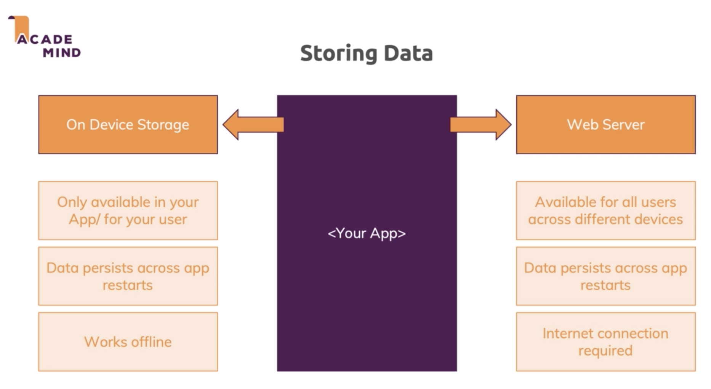
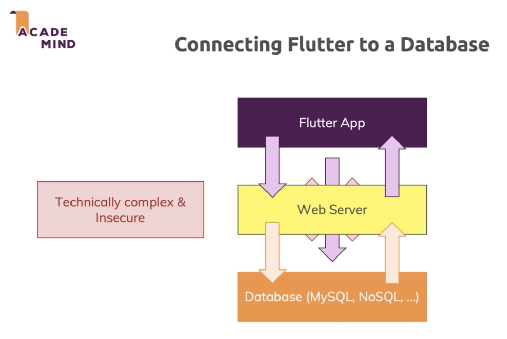

# reworked_flutter_course

Project to learn and practice different aspects
of app development using Flutter Framework.

## Content
  ### [Module 8] - Widget State Management
   * Starting with simple ecommerce App.
   * Introducing to [Widget State Management](https://flutter-es.io/docs/development/data-and-backend/state-mgmt/simple) and
     Centralized State Management using the Provider pattern.
   * Introducting to flutter's [Provider package](https://pub.dev/packages/provider) to apply the provider pattern quickly to our app project.
   * Introducing to [Dependency Injection](https://medium.com/flutter-community/dependency-injection-in-flutter-f19fb66a0740)
   * Reviewing: [Providers](https://medium.com/@sarlmnt.soul/flutter-provider-para-principiantes-guia-de-inicio-f304c1318d5e) vs [Stateful Widgets](https://api.flutter.dev/flutter/widgets/StatefulWidget-class.html)
   * Reviewing: Providers.of<T> context vs Consumer Widget management approaches.
   * Implementing flutter's [Intl package](https://pub.dev/packages/intl) to manage custom date formats.
   * [State Management - Extra](https://flutter.dev/docs/development/data-and-backend/state-mgmt/intro)

  ### [Module 9] - User interaction & Form Input
   * Introducing to [Forms](https://medium.com/swlh/working-with-forms-in-flutter-a176cca9449a)
   * Introducing to [FocusNode Class](https://flutter.dev/docs/cookbook/forms/focus)
   * Introducing to [Text editing controllers](https://flutter.dev/docs/cookbook/forms/text-field-changes)   
   * Introducing to [Forms Validation](https://flutter.dev/docs/cookbook/forms/validation)

  ### [Module 10] - Http Requests
   * Now data that we're managing with our app (i.e products, orders, carts and more) persist   through any APP restart, closing, etc.
   * Introducing to Storing Data & HTTP
   * Introducing to [Firebase database](https://firebase.google.com/docs/database/?hl=es-419)
   * Implementing [Firebase](https://firebase.google.com/docs/flutter/setup) to our flutter project - [Extra]()
   * Introducing to HTTP Requests (store/fetch data)
   * Implementing official [HTTP package for flutter](https://pub.dev/packages/http#-readme-tab-)
   * Introducing to loading progress status
   * Handling Errors
  

    #### Storing data
    

    #### Connecting flutter to a database
    

    #### Http Request
    